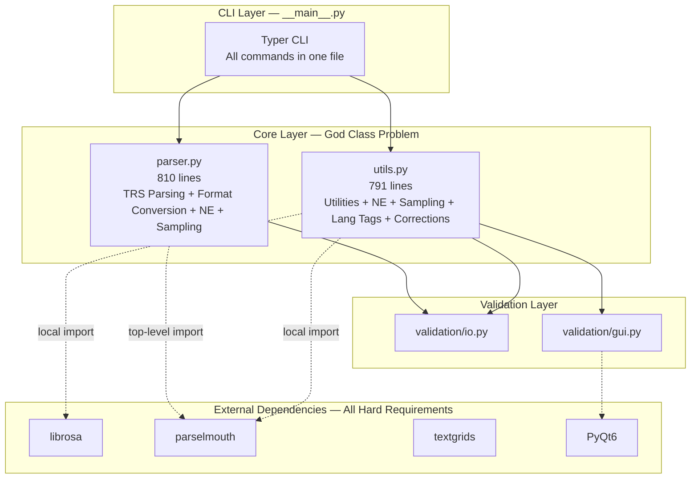
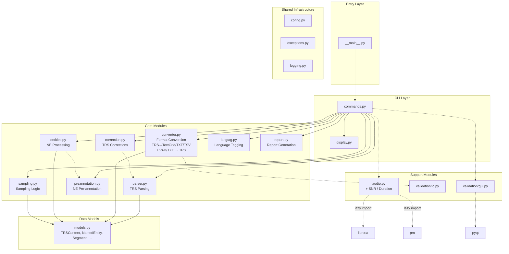

# Architecture Suggestion

This page summarizes the current project issues and proposed improvements,
with progress annotations based on the current state of the codebase.

## Current Issues

### God Class Problem

| File | Lines | Responsibilities | Problem | Status |
|------|-------|-----------------|---------|--------|
| `parser.py` | ~810 | TRS parsing, TextGrid export, TXT export, TSV export, VAD import, NE extraction, audio sampling, report extraction | 4+ different reasons to change | :octicons-x-circle-24:{ .red } Open |
| `utils.py` | ~791 | Utility functions, NE processing, sampling helpers, language tagging, corrections, pre-annotation, report generation | Business logic mixed with utilities, tangled dependencies | :octicons-x-circle-24:{ .red } Open |

### Other Issues

| Dimension | Current State | Problem | Status |
|-----------|--------------|---------|--------|
| Architecture | Single-layer structure | Blurred responsibility boundaries, difficult to extend | :octicons-x-circle-24:{ .red } Open |
| Code | Mixed style | Incomplete type annotations, no unified standards | :octicons-dot-24:{ .amber } Partial — docstrings added, ruff configured |
| CLI | Monolithic `__main__.py` | No configuration management, no progress feedback, no layer separation | :octicons-x-circle-24:{ .red } Open |
| Testing | CLI integration tests only | Missing unit tests, integration tests, and boundary tests | :octicons-dot-24:{ .amber } Partial — basic CLI tests exist, CI set up |
| Documentation | Auto-generated from docstrings | API docs stay in sync with code | :octicons-check-circle-24:{ .green } Resolved |
| Heavy dependencies | `librosa`, `parselmouth` top-level imports | Slow startup, no optional extras | :octicons-x-circle-24:{ .red } Open |
| Exception hierarchy | Built-in exceptions only | No domain-specific errors | :octicons-x-circle-24:{ .red } Open |
| Optional deps | All deps are hard requirements | No graceful degradation when audio/GUI deps are missing | :octicons-x-circle-24:{ .red } Open |

### Current Architecture



## Proposed Architecture: Modular Monolith

We propose a **modular monolith** architecture over a four-tier (Presentation / Application / Domain / Infrastructure) approach, based on the following considerations:

- **Evolutionary Architecture** — Architecture should evolve with requirements, not be designed upfront. A four-tier architecture for a ~3,000-line project violates the YAGNI principle.
- **Modular Monolith** — Separation of concerns is achieved through clear module boundaries (package/directory structure) rather than physical isolation (layers/services).
- **Pragmatic SRP** — Module decomposition should be based on *reasons to change*, not technical layers. `parser.py` should split into `converter.py`, `entities.py`, and `sampling.py`, but further layering would only add indirection.
- **Cognitive Complexity** — The flat call path of a modular monolith has lower cognitive load than traversing four layers.

### Target Architecture



!!! info "Key dependency corrections vs previous diagram"
    - **Removed `parser → converter`** — parser only *produces* `TRSContent`, converter only *consumes* it; the commands layer orchestrates the pipeline.
    - **Added `models.py`** — shared data types (`TRSContent`, `NamedEntity`, `Segment`, etc.) that both parser and converter depend on.
    - **Added `preannotation.py`** — extracted from `utils.py` (`trs_preannotation`, `pre_annotate_ne_len1`, `pre_annotate_ne_len_plus`); depends on `entities`.
    - **Added `correction.py`** — extracted from `utils.py` (`correction_la`, `correction_maj`, `turn_difference_trs`, `trs_empty_space_before_ne`); depends on parser to modify TRS content.
    - **Added `langtag.py`** — extracted from `utils.py` (`add_lang_tag`).
    - **Added `report.py`** — extracted from `utils.py` (`tmp_report`, `parse_json`).
    - **`converter.py` now includes reverse conversion** — `txt_to_trs`, `textgrid_to_trs`, `vad_to_trs` from `parser.py`.
    - **`audio.py` now includes `praat_snr_for_segment`** — extracted from `parser.py`.

### Proposed Directory Structure

```
src/trsproc/
├── __init__.py
├── __main__.py              # CLI entry (slim, delegates to commands)
├── cli/                     # CLI layer
│   ├── __init__.py
│   ├── commands.py          # Command definitions (extracted from __main__.py)
│   └── display.py           # Rich output / tables / progress bars
├── models.py                # Shared data types (TRSContent, NamedEntity, Segment, …)
├── parser.py                # TRS parsing only (slimmed down from original)
├── converter.py             # Format conversion (TRS↔TextGrid/TXT/TSV, VAD/TXT→TRS)
├── entities.py              # NE processing (extracted from utils.py)
├── sampling.py              # Sampling logic (extracted from utils.py)
├── preannotation.py         # NE pre-annotation (extracted from utils.py)
├── correction.py            # TRS corrections (extracted from utils.py)
├── langtag.py               # Language tagging (extracted from utils.py)
├── report.py                # Report generation + JSON parsing (extracted from utils.py)
├── validation/
│   ├── io.py                # Validation I/O
│   └── gui.py               # Validation GUI
├── audio.py                 # Audio processing + SNR (lazy imports librosa/parselmouth)
└── core/
    ├── config.py            # Configuration management
    ├── exceptions.py        # Exception hierarchy
    └── logging.py           # Logging configuration
```

Key differences from a four-tier architecture:

- **No application/domain/infrastructure layers** — modules call each other directly
- **No dependency injection container** — the project has no multiple implementations to switch between
- **No Repository pattern** — the only backend is the filesystem
- **parser.py split into 10 modules** — resolves the God Class by single-responsibility decomposition
- **`models.py` as shared data contract** — parser and converter communicate through typed data structures, not direct function calls

## Key Improvements

### 1. Module Decomposition

!!! todo "Not started"
    `parser.py` (810 lines) and `utils.py` (791 lines) are still monolithic.

```python
# Before: parser.py handles all responsibilities
class TRSParser:
    def parse(self, ...): ...        # TRS parsing
    def to_textgrid(self, ...): ...  # Format conversion
    def to_txt(self, ...): ...       # Format conversion
    def to_tsv(self, ...): ...       # Format conversion
    def retrieve_ne_to_tsv(self, ...): ...  # NE processing
    def validate_trs(self, ...): ... # Validation
    def clean_ne_from_trs(self, ...): ...  # NE processing
    def trs_tmp(self, ...): ...      # Report generation

# Before: utils.py mixes business logic with utilities
def random_sampling(...): ...        # Sampling
def trs_preannotation(...): ...      # Pre-annotation
def pre_annotate_ne_len1(...): ...   # Pre-annotation
def add_lang_tag(...): ...           # Language tagging
def correction_la(...): ...          # Correction
def correction_maj(...): ...         # Correction
def tmp_report(...): ...             # Report generation
def parse_json(...): ...             # JSON parsing (for reports)

# After: split into independent modules by responsibility

# models.py — Shared data types
@dataclass
class TRSContent: ...
@dataclass
class NamedEntity: ...
@dataclass
class Segment: ...

# parser.py — TRS parsing only
class TRSParser:
    def parse(self, path: Path) -> TRSContent: ...

# converter.py — Format conversion (both directions)
def to_textgrid(content: TRSContent) -> TextGrid: ...
def to_txt(content: TRSContent) -> str: ...
def to_tsv(content: TRSContent) -> str: ...
def txt_to_trs(path: Path) -> TRSContent: ...
def textgrid_to_trs(path: Path) -> TRSContent: ...
def vad_to_trs(path: Path) -> TRSContent: ...

# entities.py — NE processing
def get_ne_list(content: TRSContent) -> list[NamedEntity]: ...
def clean_ne(content: TRSContent) -> TRSContent: ...

# sampling.py — Sampling logic
def sample_segments(content: TRSContent, n: int) -> list[Segment]: ...
def random_sampling(files: list[Path], ...) -> None: ...

# preannotation.py — NE pre-annotation
def pre_annotate(content: TRSContent, ne_dict: dict) -> TRSContent: ...
def pre_annotate_ne_len1(content: TRSContent, ne_dict: dict) -> TRSContent: ...
def pre_annotate_ne_len_plus(content: TRSContent, ne_list: list) -> TRSContent: ...

# correction.py — TRS corrections
def correction_la(content: TRSContent) -> TRSContent: ...
def correction_maj(content: TRSContent) -> TRSContent: ...
def turn_difference(content: TRSContent) -> dict: ...

# langtag.py — Language tagging
def add_lang_tag(content: TRSContent, ...) -> TRSContent: ...

# report.py — Report generation
def generate_report(content: TRSContent, section_type: str) -> str: ...
def parse_json(json_input: str) -> dict: ...
```

### 2. Lazy Imports for Heavy Dependencies

!!! todo "Not started"
    `parselmouth` is still a top-level import in `parser.py`.
    `librosa` and `parselmouth` are hard requirements in `pyproject.toml`.

`librosa` and `parselmouth` are currently imported at module top level, triggering loading even when audio features are not used (~2-3 seconds for librosa).

```python
# src/trsproc/audio.py
from pathlib import Path
from typing import TYPE_CHECKING

if TYPE_CHECKING:
    import librosa
    import parselmouth

def get_duration(audio_path: Path) -> float:
    """Get audio duration (lazy import librosa)."""
    import librosa
    duration, _ = librosa.get_duration(filename=str(audio_path))
    return duration
```

### 3. Exception Hierarchy

!!! todo "Not started"
    No custom exception classes exist in the codebase.

```python
# src/trsproc/core/exceptions.py
class TRSProcError(Exception):
    """Base exception class."""

class FileError(TRSProcError):
    """File operation exception."""

class ParseError(TRSProcError):
    """Parse exception."""

class ValidationError(TRSProcError):
    """Validation exception."""

class ConversionError(TRSProcError):
    """Conversion exception."""

class AudioError(TRSProcError):
    """Audio processing exception."""
```

### 4. Progressive Enhancement via Optional Dependencies

!!! todo "Not started"
    All dependencies are hard requirements. No `[audio]` or `[gui]` extras.

```python
# Graceful degradation when optional deps are missing
try:
    from .audio import get_duration
    HAS_AUDIO = True
except ImportError:
    HAS_AUDIO = False

@app.command()
def validate(audio: bool = False):
    if audio and not HAS_AUDIO:
        print("Audio support not installed. Run: pip install trsproc[audio]")
        return
```

## Implementation Roadmap

| Phase | Scope | Status |
|-------|-------|--------|
| 1. Basic improvements | Code style, type annotations, exception hierarchy, config management, basic tests | :octicons-dot-24:{ .amber } Partial — docstrings added, ruff configured, CLI tests + CI exist |
| 2. Module decomposition | Split `parser.py` and `utils.py`, extract CLI layer, lazy imports | :octicons-x-circle-24:{ .red } Not started |
| 3. Feature enhancement | Performance optimization, caching, parallel processing, CLI UX | :octicons-x-circle-24:{ .red } Not started |
| 4. Polish | Documentation automation, CI/CD, monitoring, release process | :octicons-dot-24:{ .amber } Partial — doc automation done |

### What Has Been Done

- :octicons-check-circle-24:{ .green } **Documentation automation** — mkdocstrings + gen-files + literate-nav pipeline; API pages auto-generated from docstrings
- :octicons-check-circle-24:{ .green } **Docstrings** — Google-style docstrings added to `parser.py`, `utils.py`, `validation/` modules
- :octicons-check-circle-24:{ .green } **Linting** — Ruff configured in `pyproject.toml` with rule selection
- :octicons-check-circle-24:{ .green } **CI** — GitHub Actions pytest workflow with multi-Python-version matrix
- :octicons-check-circle-24:{ .green } **MkDocs site** — Material theme with dark/light mode, Mermaid diagrams, code highlighting, search

### What Remains

- :octicons-x-circle-24:{ .red } **God Class decomposition** — `parser.py` (810 lines) → `parser.py` + `converter.py` + `entities.py` + `sampling.py` + `models.py` + `audio.py`
- :octicons-x-circle-24:{ .red } **Utils split** — `utils.py` (791 lines) → `entities.py` + `sampling.py` + `preannotation.py` + `correction.py` + `langtag.py` + `report.py`
- :octicons-x-circle-24:{ .red } **CLI layer extraction** — `__main__.py` → `cli/commands.py` + `cli/display.py`
- :octicons-x-circle-24:{ .red } **Lazy imports** — Move `parselmouth`/`librosa` to `audio.py` with lazy loading
- :octicons-x-circle-24:{ .red } **Exception hierarchy** — Create `core/exceptions.py` with domain-specific errors
- :octicons-x-circle-24:{ .red } **Optional dependencies** — `[audio]` and `[gui]` extras with graceful degradation
- :octicons-x-circle-24:{ .red } **Type annotations** — Full type coverage across all modules
- :octicons-x-circle-24:{ .red } **Unit tests** — Core module tests (parser, converter, entities, sampling)

## References

- [Evolutionary Architecture](https://www.thoughtworks.com/radar/techniques/evolutionary-architecture) — incremental change over upfront design
- [Modular Monolith](https://kamilgrzybek.com/blog/modular-monolith-architectural-pattern/) — module boundaries over physical isolation
- [The Pragmatic Programmer](https://pragprog.com/titles/tpp20/the-pragmatic-programmer-20th-anniversary-edition/) — right-sizing design
- [Refactoring](https://refactoring.guru/refactoring/smells) — code smells and refactoring patterns
- [Cognitive Complexity](https://www.sonarsource.com/resources/cognitive-complexity/) — measuring code maintainability
