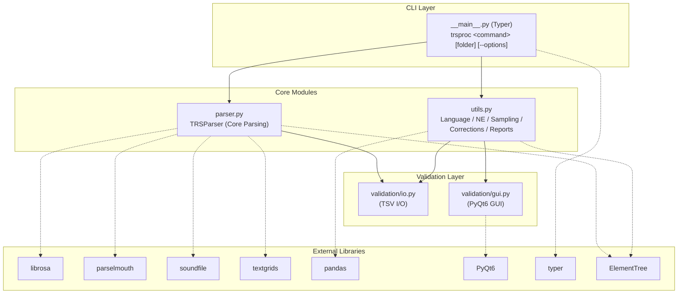
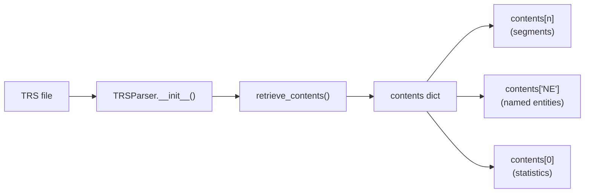
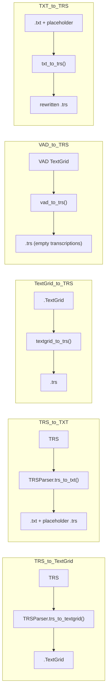
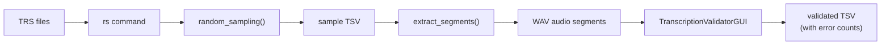

# Architecture

This page describes the internal architecture of *trsproc* — how modules are organized, how data flows through the system, and how CLI commands map to internal functions.

## Overall Architecture

*trsproc* follows a layered architecture with three main tiers:



### CLI Layer (`__main__.py`)

The entry point for command-line usage, built with [Typer](https://typer.tiangolo.com/). It defines all available commands and delegates to the appropriate core module functions.

Key design patterns:

- **`get_files()`** — A shared utility that resolves file/folder arguments, defaulting to the current working directory
- **Command instantiation** — Each command creates a `TRSParser` instance from the target file, then calls the corresponding method
- **Sub-commands** — The `crt` (corrections) group is implemented as a Typer sub-app

### Core Modules

#### `parser.py` — Core Parsing Engine

The heart of *trsproc*. Contains:

- **`TRSParser` class** — Parses TRS files into structured Python dictionaries with segment-level detail, speaker info, NE annotations, and statistics
- **Standalone conversion functions** — `textgrid_to_trs()`, `vad_to_trs()`, `txt_to_trs()` — these create TRS files from external formats without needing a `TRSParser` instance
- **Utility functions** — `replace_punctuations()`, `praat_snr_for_segment()`

The parser uses a **line-by-line scanning approach** rather than pure DOM parsing, because TRS `<Turn>` elements use a mixed content model (XML elements and text content interleaved).

#### `utils.py` — Processing Utilities

Higher-level operations that work with `TRSParser` instances:

| Category | Functions |
|----------|-----------|
| Language tagging | `add_lang_tag()`, `parse_json()` |
| Named entities | `trs_preannotation()`, `pre_annotate_ne_len1()`, `pre_annotate_ne_len_plus()`, `create_update_dict_ne()` |
| Random sampling | `random_sampling()`, `random_sampling_ne()`, `sample_from_dict()`, `extract_segments()` |
| Corrections | `turn_difference_trs()`, `trs_empty_space_before_ne()`, `correction_la()`, `correction_maj()` |
| Reports | `tmp_report()` |

### Validation Layer (`validation/`)

A dedicated sub-package for transcription validation with a GUI:

#### `validation/io.py` — Data I/O

- **`ValidationPaths`** — A frozen dataclass that resolves input TSV, audio directory, and output paths
- **`load_validation_tsv()`** — Reads and normalizes a validation TSV into a pandas DataFrame
- **`save_validated_tsv_atomic()`** — Atomic write (write to `.tmp`, then rename) to prevent data loss
- **`compute_totals()`**, **`build_output_df_with_summary()`** — Aggregate error counts
- **`is_validation_complete()`** — Checks whether all segments have been validated

#### `validation/gui.py` — PyQt6 Validation GUI

A full-featured desktop application for audio transcription validation:

- Audio playback with seek bar and play/pause/replay controls
- Segment and transcript error counting via spinboxes
- Keyboard shortcuts (Space, R, Enter, arrow keys)
- Dirty-state tracking with save-before-continue prompts
- Progress tracking and final summary with cleanup option

## Data Flow

### TRS Parsing



### Format Conversions



### Named Entity Workflow


### Validation Workflow



## TRSParser Data Structure

The `contents` dictionary is the central data structure returned by `TRSParser`:

```
contents[n]                    # Segment n (1-indexed)
  ├── xmin                     # Start time (seconds)
  ├── xmax                     # End time (seconds)
  ├── duration                 # Duration (seconds)
  ├── tokens                   # Token count
  ├── content                  # Transcription text
  ├── speaker                  # Speaker ID ("NA" if none)
  ├── speaker_type             # "single" or "multi"
  ├── langs                    # List of language tags
  └── SNR                      # Signal-to-noise ratio (or "NA")

contents['NE'][n]              # Named Entity n
  ├── class                    # Entity class (e.g. "loc", "pers", "org")
  ├── xmin                     # Start time
  ├── segmentID                # ID of the containing segment
  └── content                  # Entity text

contents[0]                    # Overall statistics
  ├── totalSegments            # Total number of segments
  ├── totalWords               # Total word count
  ├── totalNE                  # Total named entities
  ├── totalNonTrans            # Total non-transcribed segments
  ├── totalPronPi              # Total pronunciation-problem marks
  ├── totalTrans               # Total transcribed segments
  ├── totalLang                # Total language tags
  ├── otherLang                # Set of other languages used
  ├── duration                 # Total duration
  ├── durationTrans            # Transcribed duration
  ├── durationNonTrans         # Non-transcribed duration
  └── meanSNR                  # Mean SNR (or "NA")
```

## CLI Command Mapping

| CLI Command | Module | Method / Function |
|-------------|--------|-------------------|
| `trsproc txt` | parser | `TRSParser.trs_to_txt()` |
| `trsproc trs` | parser | `parser.txt_to_trs()` |
| `trsproc tsv` | parser | `TRSParser.trs_to_tsv()` |
| `trsproc cne` | parser | `TRSParser.clean_ne_from_trs()` |
| `trsproc ne` | parser | `TRSParser.retrieve_ne_to_tsv()` |
| `trsproc pne` | utils | `utils.trs_preannotation()` |
| `trsproc lang` | utils | `utils.add_lang_tag()` |
| `trsproc tg` | parser | `TRSParser.trs_to_textgrid()` |
| `trsproc tgrs` | parser | `parser.textgrid_to_trs()` |
| `trsproc vad` | parser | `parser.vad_to_trs()` |
| `trsproc tmp` | parser | `TRSParser.trs_tmp()` |
| `trsproc vsi` | parser | `TRSParser.validate_trs()` |
| `trsproc vsi-lang` | parser | `TRSParser.summary_lang_trs()` |
| `trsproc prt` | parser | `TRSParser.print()` |
| `trsproc rpt` | utils | `utils.tmp_report()` |
| `trsproc rs` | utils + validation | `utils.random_sampling()` → GUI |
| `trsproc rsne` | utils | `utils.random_sampling_ne()` |
| `trsproc crt turn-differences` | utils | `utils.turn_difference_trs()` |
| `trsproc crt empty-space` | utils | `utils.trs_empty_space_before_ne()` |
| `trsproc crt la` | utils | `utils.correction_la()` |
| `trsproc crt maj` | utils | `utils.correction_maj()` |

## Source File Layout

```
src/trsproc/
├── __init__.py          # Package version
├── __main__.py          # CLI entry point (Typer commands)
├── parser.py            # TRSParser class + conversion functions
├── utils.py             # Processing utilities (NE, lang, sampling, corrections)
└── validation/
    ├── __init__.py
    ├── gui.py           # PyQt6 validation GUI
    └── io.py            # Validation TSV I/O + ValidationPaths
```
