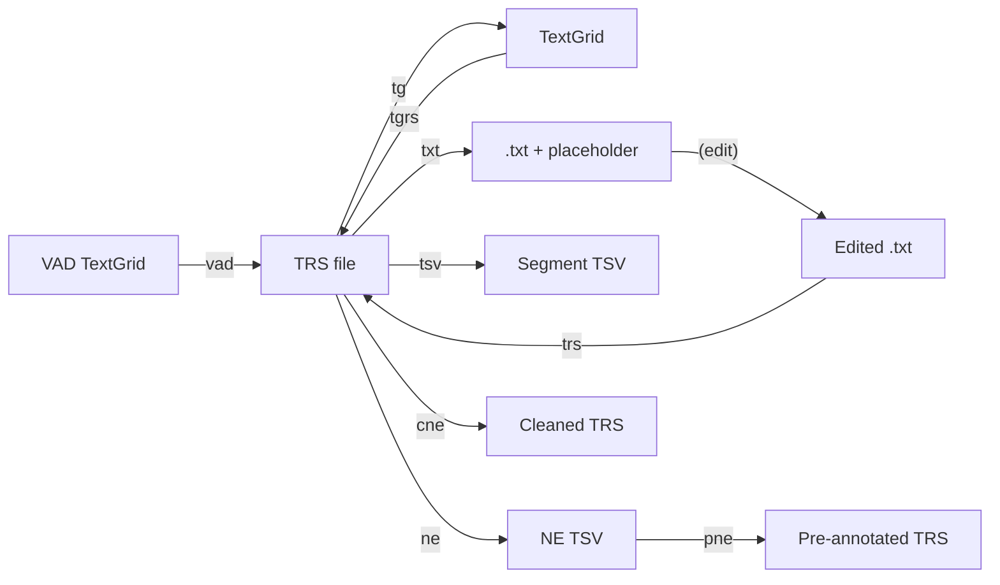
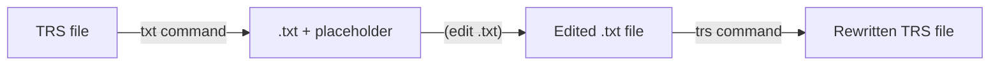

# Conversion Guide

*trsproc* supports conversion between TRS and other file formats used in speech processing workflows.

## Overview



## TRS → TextGrid

Convert a TRS file to a Praat TextGrid file using the `tg` command:

```bash
trsproc tg
```

Or via Python:

```python
from trsproc.parser import TRSParser

trs = TRSParser("interview.trs")
trs.trs_to_textgrid()
```

### Output Structure

The resulting TextGrid has four tiers by default:

| Tier | Content |
|------|---------|
| `transcription` | Segment transcription text |
| `speaker` | Speaker name (from `<Speaker>` `name` attribute) |
| `sex` | Speaker gender (from `<Speaker>` `type` attribute) |
| `NE` | Named entities in `class:content_` format (underscore-separated if multiple) |

You can customize which tiers to include:

```python
trs.trs_to_textgrid(tiers_list=["transcription", "speaker"])
```

### Requirements

- The TRS file must have a corresponding audio file (for the `xmax` value of the TextGrid)
- The `file_duration` attribute must not be `"audio not found"`

## TextGrid → TRS

Convert a Praat TextGrid file to a TRS file using the `tgrs` command:

```bash
trsproc tgrs
```

Or via Python:

```python
from trsproc.parser import textgrid_to_trs

textgrid_to_trs("interview.TextGrid")
```

### Input Requirements

The TextGrid must contain the following tiers:

| Tier | Required | Content |
|------|----------|---------|
| `transcription` | Yes | Transcription text for each interval |
| `speaker` | Yes | Speaker name for each interval |
| `sex` | Yes | Speaker gender for each interval |

### Output Characteristics

- `scribe` attribute is set to the TextGrid's parent directory name
- Empty transcription segments automatically get `<Event desc="nontrans" type="noise" extent="instantaneous"/>`
- Speakers are deduplicated and assigned `spk1`, `spk2`, etc.
- All content is placed in a single `<Section type="report">`

## VAD TextGrid → TRS

Convert a TextGrid file from a Voice Activity Detection (VAD) algorithm into a TRS file using the `vad` command:

```bash
trsproc vad
```

Or via Python:

```python
from trsproc.parser import vad_to_trs

vad_to_trs("vad_output.TextGrid")
```

### Input Requirements

The TextGrid must have a single tier named `"VAD"` with intervals labeled:

- `"speech"` — for speech segments
- anything else — for non-speech segments

### Output Characteristics

- `scribe` is an empty string
- Only one speaker: `spk1` with `name="a transcrire"` (French for "to transcribe")
- Speaker element has no `check` or `type` attributes
- Speech segments have empty transcription (ready for manual annotation)
- Non-speech segments are marked with `<Event desc="nontrans" type="noise" extent="instantaneous"/>`

This is typically the first step in a workflow where VAD output is used to create empty TRS files for annotators to fill in.

## TRS → TXT (Text Editing Workflow)

The text editing workflow allows you to extract transcription text, edit it externally, and merge it back.

### Step 1: Extract Text

```bash
trsproc txt
```

Or via Python:

```python
trs = TRSParser("interview.trs")
trs.trs_to_txt()
```

This creates:

- `txt/<filename>.txt` — Plain text with one segment per line
- `placeholder/<filename>_placeholder.trs` — TRS structure with `[placeholder N]` replacing text content

You can optionally strip punctuation:

```python
trs.trs_to_txt(delete_punct=True)
```

### Step 2: Edit the Text

Open the `.txt` file in any text editor and make corrections. **Important**: keep one segment per line — the line order must match the placeholder indices.

### Step 3: Rewrite the TRS

```bash
trsproc trs
```

This reads the edited `.txt` file and the placeholder `.trs`, merging the new text content into the original XML structure.

### Diagram



## TRS → TSV

Export the complete TRS structure to a tab-separated file:

```bash
trsproc tsv
```

Or via Python:

```python
trs = TRSParser("interview.trs")
trs.trs_to_tsv()
```

### Output Columns

| Column | Description |
|--------|-------------|
| `file_name` | TRS filename |
| `file_path` | Directory path |
| `segment` | Segment number |
| `segment_start` | Start time |
| `segment_end` | End time |
| `segment_duration` | Duration |
| `transcription` | Transcription text |
| `speaker` | Speaker name |
| `speaker_sex` | Speaker gender |

The output file is written to `<corpus>.tsv` in the same directory as the input file. When processing multiple TRS files in the same folder, all segments are appended to the same TSV.

## Named Entity Workflow

The NE workflow supports extraction, pre-annotation, and cleaning of Named Entity annotations.

### Extract NE → TSV

```bash
trsproc ne
```

Or via Python:

```python
trs = TRSParser("interview.trs")
trs.retrieve_ne_to_tsv()
```

Output file: `<corpus>_NE_extraction.tsv`

| Column | Description |
|--------|-------------|
| `file_name` | TRS filename |
| `file_path` | Directory path |
| `NE_rank` | NE index within the file |
| `NE_class` | Entity class (e.g. `pers`, `loc`, `org`) |
| `NE_content` | Entity text |
| `segment_rank` | Segment containing this NE |
| `segment_content` | Full segment text |
| `segment_start` | Segment start time |
| `segment_end` | Segment end time |
| `segment_duration` | Segment duration |
| `speaker` | Speaker name |
| `speaker_sex` | Speaker gender |

### Pre-annotate NE

Use a previously extracted NE dictionary to pre-annotate new TRS files:

```bash
trsproc pne
```

This reads the TSV created by `ne` and inserts matching `<Event type="entities">` tags into TRS files.

### Clean NE

Remove all Named Entity annotations from TRS files:

```bash
trsproc cne
```

Or via Python:

```python
trs = TRSParser("interview.trs")
trs.clean_ne_from_trs()
```

Cleaned files are written to a `clean/` subdirectory. This strips `<Event>` tags with `type="entities"` and cleans up residual whitespace.

## Section Extraction

Extract specific section types (e.g. `report`) from a TRS file into temporary files:

```bash
trsproc tmp
```

Or via Python:

```python
trs = TRSParser("interview.trs")
trs.trs_tmp(section_type="report")
```

This is useful for isolating only the transcribed sections (excluding `nontrans` or `filler`) for validation or further processing. Output files are written to a `tmp/` subdirectory.

## Language Tagging

Add language tags to transcription segments:

```bash
# Tag all segments with a specific language
trsproc lang --language fr

# Or use a JSON dictionary for per-segment language assignment
trsproc lang --json-dict lang-tag.json
```

If neither `--language` nor `--json-dict` is provided, the command looks for a `lang-tag.json` file in the current directory. Tagged files are written to a `lang/` subdirectory.
